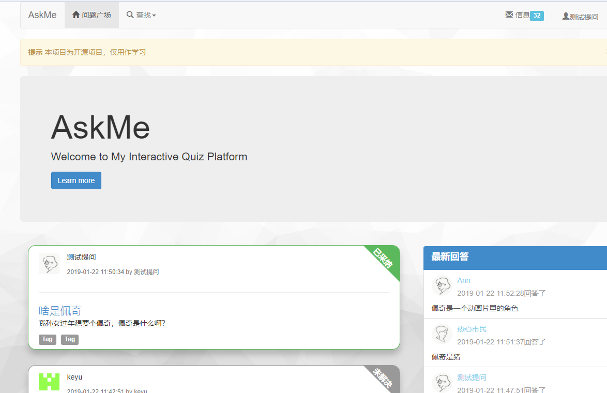

# 技术栈
* 框架
  * SpringBoot
  * 表现层：SpringMvc
  * 持久层：Mybatis
* 数据库
  * MySQL
  * Redis
* IDE
  * IntelliJ IDEA
* 工具
  * Json解析：Fastjson
  * 模板引擎：Thymeleaf
  * 前端：Bootstrap
  * 搜索引擎：solr
* 配置
  * Maven
 
# 功能
* 登录注销
* 赞和踩
* 发表问题，采纳答案
* 回答问题
* 站内信(~~前端~~)

# 表结构
## 用户(User)

字段名 | 字段类型 
---|---
id | int
name | varchar(64)
password| varchar(128)
salt| varchar(32)
head_url | varchar(256)

```sql
CREATE TABLE `user` (
    `id` int(11) unsigned NOT NULL AUTO_INCREMENT,
    `name` varchar(64) NOT NULL DEFAULT '',
    `password` varchar(128) NOT NULL DEFAULT '',
    `salt` varchar(32) NOT NULL DEFAULT '',
    `head_url` varchar(256) NOT NULL DEFAULT '',
    PRIMARY KEY (`id`),
    UNIQUE KEY `name` (`name`)
  ) ENGINE=InnoDB DEFAULT CHARSET=utf8;
```
## 站内信(Message)
字段名 | 字段类型 
---|---
id | int
fromid | int
toid| int
content| text
conversationid | varchar(45)
created_date | datetime
```sql
  CREATE TABLE `message` (
    `id` INT NOT NULL AUTO_INCREMENT,
    `from_id` INT NULL,
    `to_id` INT NULL,
    `content` TEXT NULL,
    `created_date` DATETIME NULL,
    `has_read` INT NULL,
    `conversation_id` VARCHAR(45) NOT NULL,
    PRIMARY KEY (`id`),
    INDEX `conversation_index` (`conversation_id` ASC),
    INDEX `created_date` (`created_date` ASC))
  ENGINE = InnoDB
  DEFAULT CHARACTER SET = utf8;
```

## 问题(Question)
字段名 | 字段类型 
---|---
id | int
title | varchar(255)
content | text
user_id | int
created_date | datetime
comment_count | int
status | int
```sql
CREATE TABLE `question` (
  `id` INT NOT NULL AUTO_INCREMENT,
  `title` VARCHAR(255) NOT NULL,
  `content` TEXT NULL,
  `user_id` INT NOT NULL,
  `created_date` DATETIME NOT NULL,
  `comment_count` INT NOT NULL,
  `status` INT NOT NULL,
  PRIMARY KEY (`id`),
  INDEX `date_index` (`created_date` ASC));
```

## 评论(Comment)
字段名 | 字段类型 
---|---
id |int
content |text
user_id |int
created_date |datetime
entity_id |int
entity_type |int
```sql
  CREATE TABLE `comment` (
  `id` INT NOT NULL AUTO_INCREMENT,
  `content` TEXT NOT NULL,
  `user_id` INT NOT NULL,
  `entity_id` INT NOT NULL,
  `entity_type` INT NOT NULL,
  `created_date` DATETIME NOT NULL,
  `status` INT NOT NULL DEFAULT 0,
  PRIMARY KEY (`id`),
  INDEX `entity_index` (`entity_id` ASC, `entity_type` ASC)
  ) ENGINE=InnoDB DEFAULT CHARSET=utf8;
```
## 令牌(Ticket)
字段名 | 字段类型 
---|---
id | int
user_id | int
ticket |varchar(45)
expired | datetime
status | int

```sql
CREATE TABLE `login_ticket` (
    `id` INT NOT NULL AUTO_INCREMENT,
    `user_id` INT NOT NULL,
    `ticket` VARCHAR(45) NOT NULL,
    `expired` DATETIME NOT NULL,
    `status` INT NULL DEFAULT 0,
    PRIMARY KEY (`id`),
    UNIQUE INDEX `ticket_UNIQUE` (`ticket` ASC)
    ) ENGINE=InnoDB DEFAULT CHARSET=utf8;
```

# 缓存实现
## 热点数据
对于热点数据而言，其很适合用来做缓存，可以减轻MySQL的压力。
## Redis
* Redis支持数据的持久化
* 支持数据备份
* 性能极高-Redis能读的速度是110000次/s,写的速度是81000次/s
## 具体实现
我的博客：
[项目实战:Spring Boot下关于MyBatis的二级缓存](https://keyu.site/2019/01/20/mybatisrediscache/)

# 异步队列
## 场景
### 介绍
* 频繁地对数据库的插入操作，使数据库压力增大
* 追求更快的响应速度

### 解决方案
使用异步队列使任务异步进行，将任务放进队列即可返回，不必等待执行完毕，大大增大了响应速度。  
在队列中顺序进行，对于实时性不高的任务，可以慢慢执行，减轻了数据库的压力。

### 具体实现
我的博客：[项目实战:Redis实现的异步队列缓解压力](https://keyu.site/2019/01/21/eventqueue/)